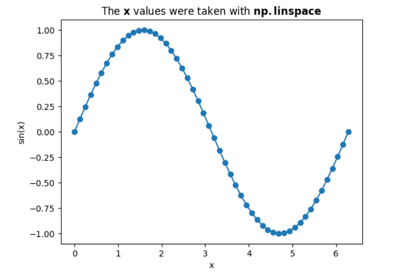

# Part II (numpy)

We take a little break from pure Python, and introduce a very useful package **numpy**. It is not part of the standard library yet easily installed, for example with (below is done in an OS shell, it is not Python):

````
pip install numpy
````

If you're working with 'pip' or with 'conda' please go and install 'numpy'. For me, 'numpy' was already available with [https://www.python.org/shell/](https://www.python.org/shell/). I've verified it with:

``` py
import numpy as np

np.__version__
```

```'1.21.6'```

(Packages also have their version, which is also very important concept to wrap your head around. For now we are good.)

We import the package and follow the convention to alias it *np*:

``` py
import numpy as np

type(np)
```

```module```

Why did I say a package? A package may contain, or bring with its installation, multiple Python modules.
We’ll talk about it later (what is a Python module?, how we create a package?, and relevant considerations).

So why is it worth it to learn about 'numpy'? Well, first it is an example of yet another useful package. Python is great, yet it is really great thanks to the ecosystem around it. There are packages for data science, packages that are part of web frameworks, packages for developing games. In particular, 'numpy', appears almost always (at least with Python software I've played with).

The theme of 'numpy' is linear algebra. For example, one can wrap a list into 'numpy.ndarray' (n-dimensional array).

``` py
arr = np.array([1, 2, 3])
arr.shape
```

```(3,)```

*len(arr)* will also work and shall return *3*.

There exists a standard module **array** in Python that also deals with memory efficient arrays. We'll skip 'array' and jump directly to 'numpy' which is what people often do these days. Potentially 'numpy' is making use of 'array' behind the scenes.

The 'shape' returns a tuple where each entry is the length of the relevant dimension. Note the comma in *(3,)*. This is to distinguish this value, which is a tuple, from *(3)* which is just the scalar *3* after the expression is evaluated.

With 'numpy' one can "index" an array with a list of integer indices:

``` py
arr = np.array([1, 2, 3, 4, 5])

arr[[0, 2]]
```

``` array([1, 3]) ```

Which allows us also to take elements multiple times as needed:

``` py
arr[[0, 2, 2, 2, 2]]
```

``` array([1, 3, 3, 3, 3]) ```

One can also access a 'numpy' array with a boolean list where each entry corresponds to the matching place in the 'numpy' array.
The boolean list needs to be of the matching length.

``` py
arr[[True, True, False, False, True]]
```

``` array([1, 2, 5]) ```

This is useful when we have (computed in previous code) **indicators**. For example:

``` py
ind = arr % 3 == 0
len(ind), arr[ind]
```

``` (5, array([3])) ```

Note that with the integer indices, we've ended with a 'numpy' array of the same length as the indices.
With the boolean indicators list, the result is a 'numpy' array of the length of the total number of Trues in the indicators list.

An important observation is that while a simple list can contain heterogeneous values, a 'numpy' array is expected to hold values of the same type in all cells. In addition to many goodies that we'll see soon, 'numpy' is intended to make the calculations fast and vectorized. Vectorisation is a technique where special hardware manipulate multiple cells at the same time.

To find the type of the elements themselves, use:

``` py
arr.dtype
```
In this example it is ```dtype('int64')```.

To find the dimension of a 'numpy' array, one can do:

``` py
len(arr.shape)
```

```1```

Here BTW we see that 'len' works also on a tuple.

I've recently learned that one can also just issue:

``` py
arr.ndim
```

Which should give the same result ```1```.

To find how many elements in a 'numpy' array, I would go for:

``` py
np.prod(arr.shape)
```

```3```

Above, we see a nice utility function from 'numpy' that takes an iterable, in this case the tuple *arr.shape*, and returns the product of the elements.

Let's go to the next dimension:

``` py
mat = np.array([[1, 2], [1, 0], [2, 1]]); mat
```

```
array([[1, 2],
       [1, 0],
       [2, 1]])
```

We used ';' to separate two expressions. The last expression *mat* is what we see in the interactive shell. We see that we got a matrix with *3* rows and *2* columns.

``` py
len(mat.shape), np.prod(mat.shape)
```

```(2, 6)```

Here we used ',' between the two expressions. This gave us the tuple *(2, 6)*. The first element of the tuple is the dimension of *mat* and the other is the count of elements in *mat* (similar to what we've verified above for *arr*).

A 2-dimentional 'numpy' array or, a "matrix" has two **axes**; *0* and *1*. One axis is the rows and the other is the columns.
Let's see that in action:

``` py
np.sum(mat), np.sum(mat, axis=0), np.sum(mat, axis=1)
```

```(7, array([4, 3]), array([3, 1, 3]))```

We can see that without the *axis* parameter we get a scalar which is the sum of all the elements. With *axis=0* the rows collapse and we get the summation per columns. With *axis=1* the columns collapse, and we end up with as many entries in the result 'numpy' array as we had rows. 

## Vectorization

'numpy' speeds calculations. In addition to the code being optimized, written probably in C, etc. There is an important concept of **vectorization**. For example, add two 'numpy' arrays of the same length, element-wise. There are at least two advantages, 1. The code does not contain an explicit loop, and 2. The implementation may make use of hardware that can indeed calculate multiple entries in parallel.

``` py
a = np.random.randn(5_000_000)
b = np.random.randn(5_000_000)
```

The vectorization way (use 'numpy' addition between two 'numpy' arrays).

``` py
%%time

c1 = a + b
```

```
CPU times: user 815 µs, sys: 10.3 ms, total: 11.1 ms
Wall time: 9.58 ms
```

``` %%time ``` is a magic command in a Jupyter notebook cell.  
With a "naïve" loop.

``` py
%%time

c2 = []
for i in range(len(a)):
    c2.append(a[i] + b[i])
c2 = np.array(c2)
```

```
CPU times: user 1.18 s, sys: 57 ms, total: 1.23 s
Wall time: 1.23 s
```

We'll learn later to write "simple computation loops" as follows, we're still not as fast as the 'numpy' vectorization.

``` py
%%time

c3 = np.array([ia + ib for ia, ib in zip(a, b)])
```

```
CPU times: user 594 ms, sys: 72.7 ms, total: 667 ms
Wall time: 667 ms
```

Just to make sure we got the same results we'll used the following. Again potential for vectorization by 'numpy'.

``` py
np.array_equal(c1, c2) and np.array_equal(c2, c3) 
```

``` True ```

Prefer 'np.array_equal' over '==', among other reasons, as the arrays may be of different lengths, in which case you probably would like to get a simple 'False' rather then an exception (a run-time error). There is also a useful 'numpy' function to compare for "about equal". 'np.allclose'.

## Reshaping

A 'numpy' array can be "reshaped".

``` py
aa = a.reshape((1000, -1)); a.shape, aa.shape
```

``` ((5000000,), (1000, 5000)) ```

``` py
a[0], a[1], aa[0, 0], aa[0, 1]
```

```
(-1.752274499506939,
 -0.3307574792704177,
 -1.752274499506939,
 -0.3307574792704177)
```

``` py
aa[0, 0] = np.pi
a[0], aa[0, 0]
```

``` (3.141592653589793, 3.141592653589793) ```

When is this (reshaping) needed?
Think for example about an image in HWC (High-Width-Channel) format and then you realize the utility function actually needs the format to be CHW. It is easy with 'numpy'.
You can also turn a HW (monochrome) into a HMC (add a dimension) when needed.

``` py
aa.reshape((1000, 5000, -1)).shape
```

``` (1000, 5000, 1) ```

With slicing notation.

``` py
aa[:, :, np.newaxis].shape
```

``` (1000, 5000, 1) ```

'np.newaxis' is just an alias to 'None'.

``` py
aa[:, :, None].shape
```

``` (1000, 5000, 1) ```

``` py
aa[np.newaxis, :, :].shape
```

``` (1, 1000, 5000) ```

``` py
aa[np.newaxis, :, :].transpose(0, 2, 1).shape
```

``` (1, 5000, 1000) ```

## Some more examples 

``` py
x = np.linspace(0, 2 * np.pi, 52)
x[:5]
```

```
array([0.        , 0.12319971, 0.24639942, 0.36959914, 0.49279885])
```

``` py
import matplotlib.pyplot as plt


plt.plot(x, np.sin(x))
plt.scatter(x, np.sin(x))
plt.xlabel("x")
plt.ylabel("sin(x)")
plt.title("The " + r"$\bf{x}$" + " values were taken with " +r"$\bf{np.linspace}$");
```



You can also experiment with 'np.arange' which accepts the step's size rather than the desired number of values.

Here is an example of a usage of the 'np.where' function.

``` py
a_or_3 = np.where(a > b, a, 3)
a_or_3.shape, a_or_3[:5]
```

```
((5000000,),
 array([ 3.14159265,  3.        ,  0.49121537, -0.38382345,  0.31436233]))
```

Note that *a > b* is a boolean array of size *5_000_000* in this example.
*a* is an array of size *5_000_000*.
The third argument could have been also an array, but we've just passing *3* which is okay,
as a single element is **broadcastable** to the shape of the other two arguments (the third argument is treated as an array full with this single value).

As an answer to ["I have two numpy arrays with floating point values and I am trying to find the indices where the numbers are approximately equal (floating point comparisons)."](https://stackoverflow.com/questions/49191460/numpy-check-where-elements-of-two-arrays-are-approximately-equal), the following was suggested (when only one argument to 'np.where' the indices are returned):

``` py
np.where(np.isclose(x, y))
```

Let's try the following advanced exercise. We're given a matrix. We return another matrix according to the following rules. If a cell in the input matrix is zero, the matching "cell" in the return matrix will be *3* by *3* zeros. Otherwise, a none zero value, will result with a matching "cell" of *3* by *3* ones. It will get soon clear when you'll see the example output.

``` py linenums="1"
def inflate(input_matrix):
    res = []
    for row in range(0, input_matrix.shape[0]):
        res_row = []
        for col in range(0, input_matrix.shape[1]):
            submatrix = input_matrix[row:row + 1, col:col + 1]
            transformed = np.zeros((3, 3)) if submatrix == 0 else np.ones((3, 3))
            res_row.append(transformed)
        res.append(np.concatenate(res_row, axis=1))
    return np.concatenate(res, axis=0)

print(mat, end="\n\n")
inflate(mat)
```

```
[[1 2]
 [1 0]
 [2 1]]

array([[1., 1., 1., 1., 1., 1.],
       [1., 1., 1., 1., 1., 1.],
       [1., 1., 1., 1., 1., 1.],
       [1., 1., 1., 0., 0., 0.],
       [1., 1., 1., 0., 0., 0.],
       [1., 1., 1., 0., 0., 0.],
       [1., 1., 1., 1., 1., 1.],
       [1., 1., 1., 1., 1., 1.],
       [1., 1., 1., 1., 1., 1.]])
```

Note that, on line *6* we access a submatrix (in this case just *1* by *1*) using indices (similar to slicing in lists).

The assignment to the variable *transformed* on line *7* needs a clarification. This is the equivalent of the ternary operator from 'C/C++'. In 'C' we have ```cond ? val_when_true : val_when_false```. With Python this would be ```val_when_true if cond else val_when_false```.

Maybe there is a smarter way to achieve what was done above in the function *inflate*. That is what I came up with. I've came with above code while playing with [Abstraction and Reasoning Corpus (ARC)](https://lab42.global/arc/), see [Oren's ARC DSL](https://github.com/zbenmo/arcdsl/).

And now it is your turn.

## Exercise

This course is originated in the Netherlands :flag_nl:. Which means that we need to do something with a windmill.
Here are some building blocks that may help.

``` py
np.tri(4)
```

```
array([[1., 0., 0., 0.],
       [1., 1., 0., 0.],
       [1., 1., 1., 0.],
       [1., 1., 1., 1.]])
```

``` py
np.tri(4).T # transpose
```

```
array([[1., 1., 1., 1.],
       [0., 1., 1., 1.],
       [0., 0., 1., 1.],
       [0., 0., 0., 1.]])
```

``` py
np.flip(np.tri(4), axis=0)
```

```
array([[1., 1., 1., 1.],
       [1., 1., 1., 0.],
       [1., 1., 0., 0.],
       [1., 0., 0., 0.]])
```
