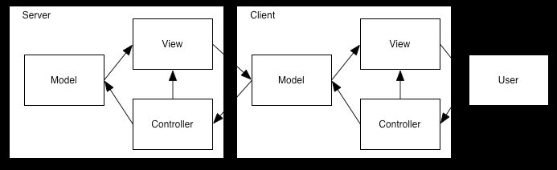

# Part IX (Flask)

In the diagram below an illustration of a typical web application, served with Flask.


We see that once an HTTP request reaches the web server / web application,
this specific applicaiton decides to query a database.
The results of the query are then rendered with the help of a template engine, and then being sent back to the browser as the response.

To above diagram, please add that once the browser receives the response (for example HTML page), it will probably also request some additional specific CSS and Javascript code that are mentioned in the HTML page.
The Javascript itself can ask for more resources from the web server / web application, often prefering JSON representation instead of HTML, so more of an API natuare. The web server / web application can serve HTML, CSS, JS, IMAGES, JSON, and additional representation formats as needed.  

Check the following if you are new to web developing:

[REST - Wikipedia](https://en.wikipedia.org/wiki/Representational_state_transfer)  
[AJAX - Wikipedia](https://en.wikipedia.org/wiki/Ajax_(programming))  
[GraphQL - Wikipedia](https://en.wikipedia.org/wiki/GraphQL) - We're not going to talk about GraphQL here.

The diagram above, is probably about the same for other frameworks such as Django, FastAPI, and others. 
If we only needed a quick static-site serving, we could do the following without installaing additional packages.

```
python -m http.server --bind 127.0.0.1
```

If we do use Flask, we need to install it, for example by adding 'Flask' to 'requirements.txt' and then:

```
pip install -r requirements.txt
```

A "hello world" application looks as follows:

```py title='app.py'
from flask import Flask


app = Flask(__name__)


@app.route("/")
def hello():
    return "Hello, World!"
```

We can then run the Flask app from the command line:

```
flask run
```

``` * Running on http://127.0.0.1:5000/ (Press CTRL+C to quit) ```

In the example above, the "view" served by the function 'hello', is decorated by the route '\'.

The module name 'app.py' is a default for the 'flask' command. If we want, we can use a different file name, but then in the command line we need to indicate where is our application.

Note that in the "hello world" example we did not make a usage of a database, neigther have we used a template. We simply retuned a string.
The next step would probably be creating a full fledged HTML file and return the contents of that file.

We can have of course multiple routes. Some of the routes may suggest the need for specific arguments from the HTTP request. Some routes may be associated with other HTTP verbs, such as "POST".

We can use a single view (function) and check for the method as in:

``` py title="handling both GET and POST by the same view"
from flask import request

@app.route('/login', methods=['GET', 'POST'])
def login():
    if request.method == 'POST':
        return do_the_login()
    else:
        return show_the_login_form()
```

Note the 'request' is, suprisingly enough, refering to our current request.

One can also provide seperate views as in:

``` py title="handling GET in one view while POST in another"
@app.get('/login')
def login_get():
    return show_the_login_form()

@app.post('/login')
def login_post():
    return do_the_login()
```

## Arguments

Below is a quick example, where a URL such as ```http://127.0.0.1/post/3``` is translated to a call to function and the argument to the funtion is taken from the URL. The URL below, passed to ```@app.route``` as an argument, contains the "variable section" ```<int:post_id>```.

``` py
@app.route('/post/<int:post_id>')
def show_post(post_id):
    # show the post with the given id, the id is an integer
    return f'Post {post_id}'
```

Above 'post_id' argument was taken from the URL. One can also access the arguments at the end of the URL.
[How can I get the named parameters from a URL using Flask? - SO](https://stackoverflow.com/questions/24892035/how-can-i-get-the-named-parameters-from-a-url-using-flask).

And also available are the form that comes in the body of a POST request.

``` py
from flask import request


@app.route('/login', methods=['POST', 'GET'])
def login():
    error = None
    if request.method == 'POST':
        if valid_login(request.form['username'],
                       request.form['password']):
            return log_the_user_in(request.form['username'])
        else:
            error = 'Invalid username/password'
    # the code below is executed if the request method
    # was GET or the credentials were invalid
    return render_template('login.html', error=error)
```

Again, remember that 'request' is our current request.

The last statement, 'render_template' brings us to the subject of 'templates', which will cover in coming subparagraph.

If we return from a view, a string, this shall be converted by Flask to a response that contains the string in its body. We can also return Python dict, or Python list, in which cases Flask shall try first to convert the return value into JSON (to JSONify). Therefore an 'add' service can be written as follows:

``` py
@app.route('/add/<int:a>/<int:b>')
def add(a, b):
    return {
      'res': a + b,
      'confidence': 0.99,
    }
```

## Templates

Template is something like an f-string. The template can include HTML and other text, and placeholders. One needs to provide the context, which is the values that shall be used to fill the placeholders. Flask is integrated with the template engine Jinja, which also supports control constructs for conditional rendering, and for loops.

``` title="a small example of a Jinja template"
<!doctype html>
<title>Hello from Flask</title>

  <h1>Hello {{ name }}!</h1>

  <h1>Hello, World!</h1>

```

Templates are most often placed in their own file, with '.html' extension. A good IDE shall hightlight / color hint, at least the HTML tags, if not also Jinja specific "control" constructs.

## Database

Often a web application is making use of a database (DB).
By using a DB, we delegate the persistance, disk operations, organizations, indexing, caching, etc, to a technology that was developed for those tasks. The web applicaiton can stay light as needed, stateless, and focus on logic and on interacting with the front-end. When load balancing is needed, we can potentially increase the number of web applications independantly from the number of database nodes instances.

In the view logic, one needs to get an access to a database handle somewhere in the begining, and then to fetch/store items in the database, using the database interface, SQL for example, and finally commit/rollback as needed.

Examples in Flask tutorial are given for a SQLite database "back-end".

``` py title="part of a tutorial where an sqlite3 DB handle is returned" linenums="1"
from flask import current_app, g


def get_db():
    if 'db' not in g:
        g.db = sqlite3.connect(
            current_app.config['DATABASE'],
            detect_types = sqlite3.PARSE_DECLTYPES
        )
        g.db.row_factory = sqlite3.Row

    return g.db


def close_db(e=None):
    db = g.pop('db', None)

    if db is not None:
        db.close()
```

Note the use of request-span caching on the handy 'g' dict (lines 5-10).

Also note that in line 10, we ask that rows returned from queries shall be provided as dicts, so one can refer to the specific column with simple dict indexing, such as ```cur_row['user']```. 

## ORM

When we use SQLite for example, we issue SQL that is understood by SQLite. There are two issues here. One is that we need some control of SQL (and be aware of SQLite specifics). Then, when we'll consider another database, we may need to change some of the queries, and in multiple places.

``` py title="example snippet with SQLite SQL 'UPDATE' statement (not ORM)"
...
db = get_db()
db.execute(
    'UPDATE post SET title = ?, body = ?'
    ' WHERE id = ?',
    (title, body, id)
)
db.commit()
return redirect(url_for('blog.index'))
```

Note in above example, the usage of '?' placeholder in the 'execute' method call. The alternative of formatting the SQL statement as a string is openning the door to **SQL Injection**, and may also be less efficient.
Also note the return of 'redirect' which is a good practice at the end of serving a "POST" request, as to take the browser as quick as possible out of a possible "duplicate POSTs" situation. 

There exist software packages that allow one to work with, for example Python objects, and behind the scenes translate to SQL. This is especially handy as those packages support multiple back-end databases, and so they hide the specific implementation. An example of such a package is SQLAlchemy. Below is an example snippet of code written with SQLAlchemy.

``` py title="code making use of SQLAlchemy"
# Above you have defined the 'User' class.

stmt = select(User).where(User.name == "patrick")
patrick = session.scalars(stmt).one()

# Here is a more involved example
# (also assume you have already also the 'Address' class).

stmt = (
     select(Address)
     .join(Address.user)
     .where(User.name == "sandy")
     .where(Address.email_address == "sandy@sqlalchemy.org")
)
sandy_address = session.scalars(stmt).one()
```

Consider using SQLAlchemy or similar if your application is indeed entities and relations cetric one.
If you are using Django rather than Flask, then Django comes with its own built-in ORM.

## Model-View-Controller (MVC)

MVC is an weakly defined "design pattern", or an abstract framework, by which we should organize the code into entry points (controllers), then the business logic (the models), and finally the way the user is presented with the content (the views). There are many interpretations, variations, and implementations. The general idea is good and helpful; one can change one component without changing the whole system.

We have already talked about views. In Flask those are the functions that are associated with routes.
In MVC terminology, those functions may actually be refered to as the controllers, as those are the entry points.
Then the templates can be considered as the views.
Finally we can wrap the logic and database access into models, with or without the usage of SQLAlchemy.

We should try to place web-interaction logic into the controller portion, our business logic into the model portion, and the presentation into the rendered templates and returned dicts-JSONs.

Note that On the client-side there is potentially a second instance of the MVC setting.
The end-user interacts with controls such as textedits and buttons.
The controls may in turn invoke Javascript code that modifies models.
The (Javascript objects) models may achieve their goals by interacting with the back-end web servers (and throught them the web applications and databases).
The communication can be realized by the JSON protocol and API-like end points.
When a model is modified, an HTML view may need to be rendered. The CSS that was waiting there quitely may come into action thanks to the browser capabilities.
You may use "event" mechanisms to separate concerns and to only loosly tie all the components together. 

<figure>
  
  <figcaption>MVC on the server and also on the client<br>https://blog.osteele.com/2004/08/web-mvc/</figcaption>
</figure>

## Cookies, Sessions, etc.

When a visitor first accesses your web-site, you may suggest that they log-in first.
Once logged-in, you may want to remember who the current logged-in user is, as to avoid asking for credentials again and again. You want to associate the "session" with the user.

Unfortunatly, the model of working is request-reply, there is no "native" concept of a session. One can achieve a session, by associated IP address with a session, or something similar. A complementary mechanism is the cookies, in which the server sends a piece of encoded text, the cookie, to the browser. The brower sends the cookie back to the server on next requests. The server verifies that the text is the original and that it contains a "key" to more session related items such as the current logged-in user.

Note that the user/browser are not supposed to see the content of the secrets in the cookie, yet they need to cooperate with this mechanism, as to allow it, and to send the cookie as needed.

One can add a cookie to the response, and find cookies in the request.

``` py title="code taken from SO: https://stackoverflow.com/questions/46661083/how-to-set-cookie-in-python-flask"
@app.route('/')
def index():
    resp = make_response(render_template(...))
    resp.set_cookie('somecookiename', 'I am cookie')
    return resp 

@app.route('/get-cookie/')
def get_cookie():
    username = request.cookies.get('somecookiename')    
```

Following the tutorials it seems that it is better not to use cookies directly, but rather throught the session object, again somewhat suprisingly to me (a good surprise), refers to the current session.

``` py
from flask import session

# Set the secret key to some random bytes. Keep this really secret!
app.secret_key = b'_5#y2L"F4Q8z\n\xec]/'

@app.route('/')
def index():
    if 'username' in session:
        return f'Logged in as {session["username"]}'
    return 'You are not logged in'

@app.route('/login', methods=['GET', 'POST'])
def login():
    if request.method == 'POST':
        session['username'] = request.form['username']
        return redirect(url_for('index'))
    return '''
        <form method="post">
            <p><input type=text name=username>
            <p><input type=submit value=Login>
        </form>
    '''

@app.route('/logout')
def logout():
    # remove the username from the session if it's there
    session.pop('username', None)
    return redirect(url_for('index'))
```