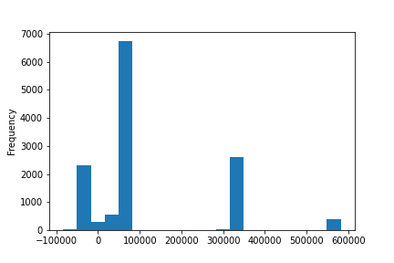

# Part VII (pandas)

We'll talk about 'pandas' which is a very useful Python package that enables us to do Excel-like, or SQL-like, data manipulations in our code.

Often one will have:

``` py
import numpy as np
import pandas as pd
...
```

While 'pandas' dependents on 'numpy', 'numpy' is the linear algebra, matrix manipulations, and performance (vectorizing) considerations.
'pandas' is oriented toward the data-scientist.
'pandas' adds the "tabular" manipulation, filtering rows, merging tables, creating "calculated columns" and more.

To create a **dataframe** one needs values that can fit into rows / columns table.
For example we can assemble a dataframe with a dict where the keys are the "columns" and the values are lists with matching values.
The lists should be of the same length.

``` py
df = pd.DataFrame({
    'name': ['Jan', 'Oren', 'Michael'],
    'age': [30, 20, 40]
}); df.shape
```

``` (3, 2) ```

``` py
df
```

<table border="1" class="dataframe">  <thead>    <tr style="text-align: right;">      <th></th>      <th>name</th>      <th>age</th>    </tr>  </thead>  <tbody>    <tr>      <th>0</th>      <td>Jan</td>      <td>30</td>    </tr>    <tr>      <th>1</th>      <td>Oren</td>      <td>20</td>    </tr>    <tr>      <th>2</th>      <td>Michael</td>      <td>40</td>    </tr>  </tbody></table>

Note that a 'pandas' dataframe has two indices, the columns index ``` df.columns ```, and the rows index ``` df.index ```.

``` py
df.columns, df.index
```

```
(Index(['name', 'age'], dtype='object'), RangeIndex(start=0, stop=3, step=1))
```

An alternative can be to assemble a dataframe from "records" with the same structure.

``` py
def records():
    for i in range(5):
        yield (i + 1,  i + ord('a'), 90 - i, 3 ** i)


pd.DataFrame.from_records(records(), columns=['c1','c2','c3', 'c4'])
```

<table border="1" class="dataframe">  <thead>    <tr style="text-align: right;">      <th></th>      <th>c1</th>      <th>c2</th>      <th>c3</th>      <th>c4</th>    </tr>  </thead>  <tbody>    <tr>      <th>0</th>      <td>1</td>      <td>97</td>      <td>90</td>      <td>1</td>    </tr>    <tr>      <th>1</th>      <td>2</td>      <td>98</td>      <td>89</td>      <td>3</td>    </tr>    <tr>      <th>2</th>      <td>3</td>      <td>99</td>      <td>88</td>      <td>9</td>    </tr>    <tr>      <th>3</th>      <td>4</td>      <td>100</td>      <td>87</td>      <td>27</td>    </tr>    <tr>      <th>4</th>      <td>5</td>      <td>101</td>      <td>86</td>      <td>81</td>    </tr>  </tbody></table>

We can also initialize a dataframe from 'numpy' 2d-array:

``` py
df_from_np_matrix = pd.DataFrame(np.random.randn(8, 5), columns=list("ABCDE"))
df_from_np_matrix
```

<table border="1" class="dataframe">  <thead>    <tr style="text-align: right;">      <th></th>      <th>A</th>      <th>B</th>      <th>C</th>      <th>D</th>      <th>E</th>    </tr>  </thead>  <tbody>    <tr>      <th>0</th>      <td>-0.796475</td>      <td>1.094937</td>      <td>0.085857</td>      <td>-0.422669</td>      <td>0.838842</td>    </tr>    <tr>      <th>1</th>      <td>0.193157</td>      <td>1.581320</td>      <td>-0.154880</td>      <td>-0.072739</td>      <td>0.124116</td>    </tr>    <tr>      <th>2</th>      <td>1.602135</td>      <td>0.443397</td>      <td>-1.886092</td>      <td>0.763741</td>      <td>-0.094495</td>    </tr>    <tr>      <th>3</th>      <td>-1.904237</td>      <td>-0.075916</td>      <td>-0.160738</td>      <td>0.189941</td>      <td>2.368079</td>    </tr>    <tr>      <th>4</th>      <td>-0.556937</td>      <td>0.989280</td>      <td>0.137683</td>      <td>1.488743</td>      <td>-0.647949</td>    </tr>    <tr>      <th>5</th>      <td>1.350182</td>      <td>-0.297231</td>      <td>0.854884</td>      <td>-0.344520</td>      <td>-0.129298</td>    </tr>    <tr>      <th>6</th>      <td>-1.392316</td>      <td>-2.541472</td>      <td>0.680830</td>      <td>1.210426</td>      <td>-1.091972</td>    </tr>    <tr>      <th>7</th>      <td>-0.525120</td>      <td>0.421930</td>      <td>1.668550</td>      <td>0.260011</td>      <td>1.383353</td>    </tr>  </tbody></table>

And of course, a lot of time we'll load a CSV file or a result of an SQL query from a database.

``` py
import pandas as pd
from pathlib import Path


train_path = Path("data/train")
df = pd.read_csv(train_path / "train.csv"); df.shape
```

```(13000, 28)```

In a notebook, we'll often examine the "head" of the dataframe.

``` py
df.head()
```

<div style="overflow-x: auto;">
<table border="1" class="dataframe">  <thead>    <tr style="text-align: right;">      <th></th>      <th>id</th>      <th>categoryA</th>      <th>categoryB</th>      <th>categoryC</th>      <th>categoryD</th>      <th>categoryE</th>      <th>categoryF</th>      <th>featureA</th>      <th>featureB</th>      <th>featureC</th>      <th>featureD</th>      <th>featureE</th>      <th>featureF</th>      <th>featureG</th>      <th>featureH</th>      <th>featureI</th>      <th>compositionA</th>      <th>compositionB</th>      <th>compositionC</th>      <th>compositionD</th>      <th>compositionE</th>      <th>compositionF</th>      <th>compositionG</th>      <th>compositionH</th>      <th>compositionI</th>      <th>compositionJ</th>      <th>unit</th>      <th>result</th>    </tr>  </thead>  <tbody>    <tr>      <th>0</th>      <td>a563699ca2a601c6ac64aa29986a00a90fb42b48741695b0526a286d504d17ca</td>      <td>catA_1</td>      <td>catB_0</td>      <td>catC_718</td>      <td>catD_0</td>      <td>catE_0</td>      <td>catF_0</td>      <td>75808.375</td>      <td>4.457840</td>      <td>0.005718</td>      <td>122.299437</td>      <td>30.831906</td>      <td>0.0</td>      <td>2.806036e+12</td>      <td>0.000000</td>      <td>71176346.0</td>      <td>0.0</td>      <td>10.0</td>      <td>26.0</td>      <td>0.0</td>      <td>32.0</td>      <td>3.0</td>      <td>0.0</td>      <td>9.0</td>      <td>22.26</td>      <td>20.0</td>      <td>unit_6</td>      <td>0.000458</td>    </tr>    <tr>      <th>1</th>      <td>91ab3eb3bcf6c8c1c5fe2da9ba671aa5a48c7369d9a50f32e1ddd735472b4b3c</td>      <td>catA_1</td>      <td>catB_0</td>      <td>catC_1309</td>      <td>catD_0</td>      <td>catE_0</td>      <td>catF_0</td>      <td>75808.375</td>      <td>4.457840</td>      <td>0.005718</td>      <td>122.299437</td>      <td>30.831906</td>      <td>0.0</td>      <td>2.806036e+12</td>      <td>0.000000</td>      <td>71176346.0</td>      <td>0.0</td>      <td>10.0</td>      <td>26.0</td>      <td>0.0</td>      <td>32.0</td>      <td>3.0</td>      <td>0.0</td>      <td>9.0</td>      <td>22.26</td>      <td>20.0</td>      <td>unit_6</td>      <td>0.000335</td>    </tr>    <tr>      <th>2</th>      <td>7128c51c554735d6c81862684ad6005ae12d2edbcd464487a7217fc72c03ba22</td>      <td>catA_15</td>      <td>catB_0</td>      <td>catC_1309</td>      <td>catD_0</td>      <td>catE_0</td>      <td>catF_0</td>      <td>75808.375</td>      <td>4.457840</td>      <td>0.005718</td>      <td>122.299437</td>      <td>30.831906</td>      <td>0.0</td>      <td>2.806036e+12</td>      <td>0.000000</td>      <td>71176346.0</td>      <td>0.0</td>      <td>10.0</td>      <td>26.0</td>      <td>0.0</td>      <td>32.0</td>      <td>3.0</td>      <td>0.0</td>      <td>9.0</td>      <td>22.26</td>      <td>20.0</td>      <td>unit_4</td>      <td>0.054072</td>    </tr>    <tr>      <th>3</th>      <td>c8144b52e4f63014de0a0d8e1c629bf0b05cb2696cfc23291b4f48e6491c4cb5</td>      <td>catA_0</td>      <td>catB_0</td>      <td>catC_935</td>      <td>catD_0</td>      <td>catE_0</td>      <td>catF_0</td>      <td>75808.375</td>      <td>4.457840</td>      <td>0.005718</td>      <td>122.299437</td>      <td>30.831906</td>      <td>2.0</td>      <td>2.806036e+12</td>      <td>0.000000</td>      <td>71176346.0</td>      <td>0.0</td>      <td>10.0</td>      <td>26.0</td>      <td>0.0</td>      <td>32.0</td>      <td>3.0</td>      <td>0.0</td>      <td>9.0</td>      <td>22.26</td>      <td>20.0</td>      <td>unit_5</td>      <td>0.061143</td>    </tr>    <tr>      <th>4</th>      <td>88d15a5b2df6692f23d105ff1ae82ae026be00c9271eef33e0aea97fd2110cb6</td>      <td>catA_22</td>      <td>catB_0</td>      <td>catC_1325</td>      <td>catD_0</td>      <td>catE_2</td>      <td>catF_0</td>      <td>-40055.250</td>      <td>4.363288</td>      <td>0.729194</td>      <td>93.677197</td>      <td>15.047884</td>      <td>4.0</td>      <td>1.464509e+12</td>      <td>87.158924</td>      <td>50941692.0</td>      <td>0.0</td>      <td>8.0</td>      <td>14.0</td>      <td>0.0</td>      <td>49.0</td>      <td>3.0</td>      <td>2.0</td>      <td>9.0</td>      <td>16.84</td>      <td>15.0</td>      <td>unit_15</td>      <td>0.015439</td>    </tr>  </tbody></table>
</div>

The columns of a dataframes are **series**. Each column (serie) has its data type.
We can have a quick summary of the dataframe with:

``` py
df.info()
```

```
<class 'pandas.core.frame.DataFrame'>
RangeIndex: 13000 entries, 0 to 12999
Data columns (total 28 columns):
 #   Column        Non-Null Count  Dtype  
---  ------        --------------  -----  
 0   id            13000 non-null  object 
 1   categoryA     13000 non-null  object 
 2   categoryB     13000 non-null  object 
 3   categoryC     13000 non-null  object 
 4   categoryD     13000 non-null  object 
 5   categoryE     13000 non-null  object 
 6   categoryF     13000 non-null  object 
 7   featureA      12936 non-null  float64
 8   featureB      12936 non-null  float64
 9   featureC      12936 non-null  float64
 10  featureD      12936 non-null  float64
 11  featureE      12936 non-null  float64
 12  featureF      13000 non-null  float64
 13  featureG      12936 non-null  float64
 14  featureH      12936 non-null  float64
 15  featureI      12936 non-null  float64
 16  compositionA  12936 non-null  float64
 17  compositionB  12936 non-null  float64
 18  compositionC  12936 non-null  float64
 19  compositionD  12936 non-null  float64
 20  compositionE  12936 non-null  float64
 21  compositionF  12936 non-null  float64
 22  compositionG  12936 non-null  float64
 23  compositionH  12936 non-null  float64
 24  compositionI  12936 non-null  float64
 25  compositionJ  12936 non-null  float64
 26  unit          13000 non-null  object 
 27  result        13000 non-null  float64
dtypes: float64(20), object(8)
memory usage: 2.8+ MB
```

When 'matplotlib' is available (installed in the Python virtual environment), the following shall produce a plot.

``` py
df.featureA.plot(kind="hist", bins=20);
```



Also very convenient:

``` py
df.unit.value_counts()
```

```
unit_0     2548
unit_1     1618
unit_2     1004
unit_3      993
unit_4      962
unit_6      853
unit_5      840
unit_7      787
unit_8      740
unit_9      668
unit_10     589
unit_11     455
unit_12     348
unit_13     269
unit_14     164
unit_15      96
unit_16      55
unit_17       7
unit_18       4
Name: unit, dtype: int64
```

When we create a "new" dataframe from an existing one, a lot of times, we're still sharing the cells' memory. Often this is exactly what we want to avoid the extra cost in memory and performance. Just need to be aware of it, to avoid surprises. If needed, one can always 'copy'.

``` py
df
```

<table border="1" class="dataframe">  <thead>    <tr style="text-align: right;">      <th></th>      <th>name</th>      <th>age</th>    </tr>  </thead>  <tbody>    <tr>      <th>0</th>      <td>Jan</td>      <td>30</td>    </tr>    <tr>      <th>1</th>      <td>Oren</td>      <td>20</td>    </tr>    <tr>      <th>2</th>      <td>Michael</td>      <td>40</td>    </tr>  </tbody></table>

``` py
df_head = df.head(2)
df_head
```

<table border="1" class="dataframe">  <thead>    <tr style="text-align: right;">      <th></th>      <th>name</th>      <th>age</th>    </tr>  </thead>  <tbody>    <tr>      <th>0</th>      <td>Jan</td>      <td>30</td>    </tr>    <tr>      <th>1</th>      <td>Oren</td>      <td>20</td>    </tr>  </tbody></table>

``` py
df_head.loc[0, 'age'] = 31
df_head
```

<table border="1" class="dataframe">  <thead>    <tr style="text-align: right;">      <th></th>      <th>name</th>      <th>age</th>    </tr>  </thead>  <tbody>    <tr>      <th>0</th>      <td>Jan</td>      <td>31</td>    </tr>    <tr>      <th>1</th>      <td>Oren</td>      <td>20</td>    </tr>  </tbody></table>

``` py
df
```

<table border="1" class="dataframe">  <thead>    <tr style="text-align: right;">      <th></th>      <th>name</th>      <th>age</th>    </tr>  </thead>  <tbody>    <tr>      <th>0</th>      <td>Jan</td>      <td>31</td>    </tr>    <tr>      <th>1</th>      <td>Oren</td>      <td>20</td>    </tr>    <tr>      <th>2</th>      <td>Michael</td>      <td>40</td>    </tr>  </tbody></table>

## Groupby

With 'pandas' we can collect statistics about specific columns. It is also interesting to collect the statistics per value in another columns. For example, collect the survival rate (Titanic) based on gender, or on travel class.
Such group based statistics is very useful in data analysis and also in ML, potentially helping the model in picking the relevant information from a categorical feature (ex. the gender, the travel class), this is called **target encoding**. Special care needs to be taken to verify the target encoding actually helps or causing **overfitting**, this should be evaluated case by case.

To get the per group statistics we use the 'df.groupby' functionality. The return type of 'groupby' on a dataframe is a 'DataFrameGroupBy'.
This class allows iterating over "sub-dataframes", one per group, or also aggragating statistics per group.

``` py
df = pd.DataFrame(
    {
        "animal": "cat dog cat fish dog cat cat".split(),
        "size": list("SSMMMLL"),
        "weight": [8, 10, 11, 1, 20, 12, 12],
        "adult": [False] * 5 + [True] * 2,
    }
)

gb = df.groupby(["animal"])

gb.get_group("cat")
```

<table border="1" class="dataframe">  <thead>    <tr style="text-align: right;">      <th></th>      <th>animal</th>      <th>size</th>      <th>weight</th>      <th>adult</th>    </tr>  </thead>  <tbody>    <tr>      <th>0</th>      <td>cat</td>      <td>S</td>      <td>8</td>      <td>False</td>    </tr>    <tr>      <th>2</th>      <td>cat</td>      <td>M</td>      <td>11</td>      <td>False</td>    </tr>    <tr>      <th>5</th>      <td>cat</td>      <td>L</td>      <td>12</td>      <td>True</td>    </tr>    <tr>      <th>6</th>      <td>cat</td>      <td>L</td>      <td>12</td>      <td>True</td>    </tr>  </tbody></table>

Above example is taken from [Pandas Cookbook - Grouping](https://pandas.pydata.org/pandas-docs/stable/user_guide/cookbook.html#grouping)

## Tidy data

We often get the data in somewhat different arrangement from what we would like to have for our data analysis, building ML models, etc. The data is given "wide" while we actually want it to be "long", or the other way around.
To change the arrangement into what we need, may seem at first to be more sort-of an art than a science.
However there are actually many things that we do see often and for which there exist a collection of formulas that are worth to get familiar with.

I will bring here for example a dataset I have played with in the past (Mammals).
The dataset is given as a table. In the table Europe is divided into cells and for each cell one can see
what mammals can be found in that cell.
Each row in the table is about a specific cell.
There are columns of three types, columns about the cell, columns related to conditions in the cell per-month (rain, temperatures, etc.),
and binary colunms per mammal (presence).

Wrote a Medium article about it [mammals-dataset-tidy-data](https://medium.com/@zbenmo/mammals-dataset-tidy-data-streamlit-6ed7ccc7b2ae)
And the relevant github link is [mammals - Github](https://github.com/zbenmo/mammals)

A quick summary of the steps taken there (Mammals dataset):

- Split the data into three tables, metadata about a cell, bio-climate features per-month about the cell, mammals-presence info about cells.
- 'melting' columns that actually contain information. Example 'mean_temp_feb_utm' columns was now a value under column 'variable', and next to the original value which is under the column 'value'.
- Spliting the values where needed into new columns. For example split 'mean_temp_feb_utm' from the 'variable' columns to the the values 'mean_temp' and 'feb_utm' under the columns 'statistics', 'month', respectively.
- pivoting the relevant values back into columns and values in those columns. For example, there should be a column called 'month' and having the relevant values, ex. 'feb_utm', and there should be columns of the bio-climate features, ex. 'mean_temp' with the matching values.
- We can then merge back tables as needed, for example I demonstrate there counting how many different mammal types are per cell, and showing that in a "map". 

Strongly recommend the following PyData YouTube-recorded talk [Daniel Chen: Cleaning and Tidying Data in Pandas | PyData DC 2018](https://www.youtube.com/watch?v=iYie42M1ZyU&t=4675s).

## Experimenting with k-folds

When we use supervised learning, for example, in machine learning (ML) setting. We'll most likely want to verify the quality of our model on some left aside "training samples". We'll call those the "evaluation set" or also known as "test set".
A common practice is for example, to keep 30% of the cases for evaluation, and train of the other 70%  (**train / test split**).
It is recommended to select the data points for the evaluation set randomly.

If we can afford the time, it might even better to repeat the experiment a few times, each time selecting a different evaluation set and training on all the other data points. For example we can take each time another 20% of the cases and train on the rest 80%, and repeat that 5 times so that each data point was 4 times in a training set, and 1 time in the test set. This setting is called **cross validation**.

We often use the 'scikit-learn' for exploratory data analysis (EDA) and for ML modeling. 'scikit-learn' contains also functions and classes that help with preprocessing, model selection and evaluation, and related tasks. The packages 'pandas' and 'scikit-learn' work well together.
For example the following will prepare for us a "train / test split".

Remember to add 'scikit=learn' to your 'requirements.txt', followed by ```pip install -r requirements.txt```, or just install it directly with for example ```pip install scikit=learn```. 

``` py
import pandas as pd
import numpy as np
from sklearn.datasets import fetch_openml
from sklearn.model_selection import train_test_split


X, y = fetch_openml("titanic", version=1, as_frame=True, return_X_y=True)
X.shape, y.shape
```

```
((1309, 13), (1309,))
```

``` py
X.info()
```

```
<class 'pandas.core.frame.DataFrame'>
RangeIndex: 1309 entries, 0 to 1308
Data columns (total 13 columns):
 #   Column     Non-Null Count  Dtype   
---  ------     --------------  -----   
 0   pclass     1309 non-null   float64 
 1   name       1309 non-null   object  
 2   sex        1309 non-null   category
 3   age        1046 non-null   float64 
 4   sibsp      1309 non-null   float64 
 5   parch      1309 non-null   float64 
 6   ticket     1309 non-null   object  
 7   fare       1308 non-null   float64 
 8   cabin      295 non-null    object  
 9   embarked   1307 non-null   category
 10  boat       486 non-null    object  
 11  body       121 non-null    float64 
 12  home.dest  745 non-null    object  
dtypes: category(2), float64(6), object(5)
memory usage: 115.4+ KB
```

``` py
train_X, validation_X, train_y, validation_y = (
    train_test_split(X, y, test_size=0.3, stratify=y, random_state=1)
)
train_X.shape, validation_X.shape
```

```
((916, 13), (393, 13))
```

Thanks to the usage of 'stratify' with the target 'y',
we have about the same ratio of survived to did-not survive in the train set and in the validation set.

``` py
(
    train_y.value_counts(normalize=True),
    '-' * 40,
    validation_y.value_counts(normalize=True)
)
```

```
(0    0.617904
 1    0.382096
 Name: survived, dtype: float64,
 '----------------------------------------',
 0    0.618321
 1    0.381679
 Name: survived, dtype: float64)
```

For cross validation setting, one can either use 'cross_val_score', letting the function run the cross validation experiment and return the final evaluation metrics as in:

``` py
scores = cross_val_score(clf, X, y, cv=5)
```

And you get a 'numpy' array with (5 in this case) results.

Another way to a achieve a cross validation split, is with the class 'StratifiedKFold'.

``` py
from sklearn.model_selection import StratifiedKFold


skf = StratifiedKFold(n_splits=5, shuffle=True, random_state=1)
for fold, (train_index, validation_index) in enumerate(skf.split(X, y)):
    print(f"Fold {fold}:")    
    print(y[validation_index].value_counts())
    print()
```

```
Fold 0:
0    162
1    100
Name: survived, dtype: int64

Fold 1:
0    162
1    100
Name: survived, dtype: int64

Fold 2:
0    162
1    100
Name: survived, dtype: int64

Fold 3:
0    162
1    100
Name: survived, dtype: int64

Fold 4:
0    161
1    100
Name: survived, dtype: int64
```

Here is an idea, taken from *Approaching (Almost) Any Machine Learning Problem* by *Abhishek Thakur*.

Most likely we'll want to compare various ML model classes and models as to find the one that gives best desired results on the validation set.
Potentially use different environments, programming languages, and libraries.
Let's start by fixing the fold for each data point.
We'll save the data with the new column added. This can be used later in any future experiment.

``` py
X['kfold'] = -1
for fold, (train_index, validation_index) in enumerate(skf.split(X, y)):
    X.loc[validation_index, 'kfold'] = fold

# Here we'll save the dataframe for future usages. Assume we have done so. 

X.kfold.value_counts()
```

```
3    262
2    262
1    262
0    262
4    261
Name: kfold, dtype: int64
```

When we want to do a cross validation experiment, we'll rely on the presense of the 'kfold' columns:

``` py
for fold in range(5):
    train_X = X.loc[lambda d: d['kfold'] != fold]
    validation_X = X.loc[lambda d: d['kfold'] == fold]
    print(f"Fold {fold}:")    
    print(train_X.shape, validation_X.shape)
    print()
```

```
Fold 0:
(1047, 14) (262, 14)

Fold 1:
(1047, 14) (262, 14)

Fold 2:
(1047, 14) (262, 14)

Fold 3:
(1047, 14) (262, 14)

Fold 4:
(1048, 14) (261, 14)
```

## Exercise

